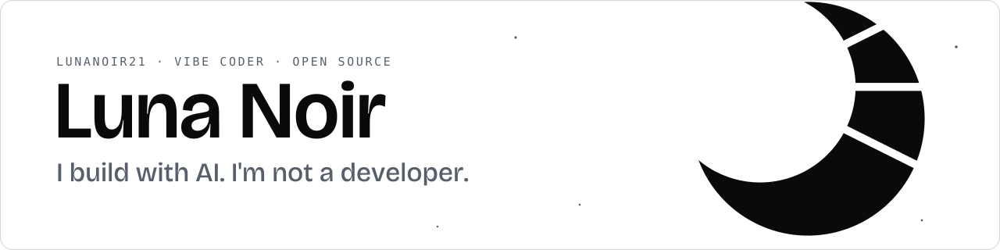
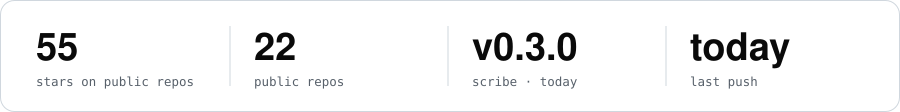
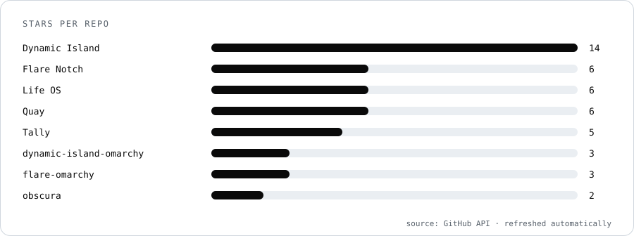

  <picture>
    <source media="(prefers-color-scheme: dark)" srcset="assets/banner-dark.svg">
    
  </picture>

  <a href="https://lunanoir21.github.io/lunanoir21/"><b>Website</b></a> ·
  <a href="https://lunanoir21.github.io/">Pixel world</a> ·
  <a href="https://github.com/lunanoir21?tab=repositories">All repositories</a>

**I'm not a developer.** I make tools and small projects together with AI, and I publish them so anyone curious can use them, learn from them or make them better. I decide what to build and how it should feel, then I run it, review it and fix what's wrong. Every project says openly that it was built with AI.

<picture><source media="(prefers-color-scheme: dark)" srcset="assets/stats-dark.svg"></picture>

## What I've made

<table>
<tr><td width="33%" valign="top"> <b><a href="https://github.com/lunanoir21/quickshell-dynamic-island">Dynamic Island</a></b> · ★ 14 Monochrome Dynamic Island for Hyprland: media, timers, pixel clock, privacy indicators.</td><td width="33%" valign="top"> <b><a href="https://github.com/lunanoir21/quickshell-quay">Quay</a></b> · ★ 6 A vertical, home-screen-style app launcher with live window previews.</td><td width="33%" valign="top"> <b><a href="https://github.com/lunanoir21/flare-notch">Flare Notch</a></b> · ★ 6 Your AI coding limits on the screen edge.</td></tr>
<tr><td width="33%" valign="top"> <b><a href="https://github.com/lunanoir21/tally-screentime">Tally</a></b> · ★ 5 Screen time for Hyprland with PNG, PDF and HTML reports.</td><td width="33%" valign="top"> <b><a href="https://github.com/lunanoir21/desktop-widget-control">Widget Control</a></b> · ★ 1 Live desktop widgets with a full editor.</td><td width="33%" valign="top"> <b><a href="https://github.com/lunanoir21/scribe">Scribe</a></b> · ★ 1 Select and copy text from anywhere on your Hyprland screen, like Google Lens.</td></tr>
<tr><td width="33%" valign="top"> <b><a href="https://github.com/lunanoir21/obscura">obscura</a></b> · ★ 1 A quiet OBS recording button for your Quickshell bar.</td><td width="33%" valign="top"> <b><a href="https://github.com/lunanoir21/dep-lens">dep-lens</a></b> · ★ 1 Dependencies, licenses and commercial-use risk across 9 ecosystems.</td><td width="33%" valign="top"> <b><a href="https://github.com/lunanoir21/inktype">Inktype</a></b> · ★ 0 Free typing practice through real books.</td></tr>
<tr><td width="33%" valign="top"> <b><a href="https://github.com/lunanoir21/Life-os-project">Life OS</a></b> · ★ 6 A local-first personal life OS.</td><td width="33%" valign="top"> <b><a href="https://github.com/lunanoir21/aurguard-project">AURGuard</a></b> · ★ 1 Checks AUR packages before you install them.</td></tr>
</table>

Also: <a href="https://github.com/lunanoir21/petty">petty</a> (a pixel-art pet for your terminal) · <a href="https://github.com/lunanoir21/orca-project">Orca</a> (a security-focused file manager (pre-release)) · <a href="https://github.com/lunanoir21/connectible-project">Connectible</a> (a KDE Connect alternative (pre-release)). Screenshots come straight from each project's own repo.

## New releases

| Project | Release | When | What changed |
| --- | --- | --- | --- |
| [Scribe](https://github.com/lunanoir21/scribe/releases/tag/v0.4.0) | `v0.4.0` | yesterday | A choice of scan animations, and less work per mouse move and per word. New: scan animation Pick the animation shown while a region is being read, in the settings panel (Scan animation): Line (the… |
| [Widget Control](https://github.com/lunanoir21/desktop-widget-control/releases/tag/v0.2.1) | `v0.2.1` | 7 days ago | Outside text is always literal. DText, the one text control every widget uses, now sets textFormat: Text.PlainText, so a track title, artist or any other string that carries HTML (an  tag, say… |
| [desktop-widget-control-omarchy](https://github.com/lunanoir21/desktop-widget-control-omarchy/releases/tag/v0.2.0) | `v0.2.0` | 8 days ago | Desktop Widget Control 0.2.0 packaged for Omarchy: adds the AI limits widget (Claude and Codex 5-hour and weekly limits as twin rings or LED dots), bounded network reads, and the first-run tour's s… |
| [Tally](https://github.com/lunanoir21/tally-screentime/releases/tag/v0.1.0) | `v0.1.0` | 9 days ago | First release. Counts what has focus, and nothing else. Focused-window time per app and per day, with hourly buckets, session counts and the longest uninterrupted run; when you go idle the minutes… |
| [Flare Notch](https://github.com/lunanoir21/flare-notch/releases/tag/v1.1.0) | `v1.1.0` | 11 days ago | A first-run setup wizard: the settings window used to open straight onto the normal tabs, with no path to change the language or say which providers to draw before the widget just started drawing a… |
| [Inktype](https://github.com/lunanoir21/inktype/releases/tag/v0.1.0) | `v0.1.0` | 14 days ago | The first release of Inktype — free, open-source typing practice through real books. Typing console in the spirit of typelit: centred current line, nine glyph-accurate cursor shapes, pause/restart… |

## Running Omarchy?

Six of my projects are packaged as [Omarchy](https://omarchy.org) plugins. One command installs and enables each. Browse more in the [Omarchy plugin marketplace](https://plugins.omarchy.org/).

| Plugin | What it does | Install | Stars |
| --- | --- | --- | --- |
| [Dynamic Island](https://github.com/lunanoir21/dynamic-island-omarchy) | Monochrome Dynamic Island for Hyprland: media, timers, pixel clock, privacy indicators. | `omarchy plugin add https://github.com/lunanoir21/dynamic-island-omarchy.git --enable` | ★ 3 |
| [Quay](https://github.com/lunanoir21/quay-omarchy) | A vertical, home-screen-style app launcher with live window previews. | `omarchy plugin add https://github.com/lunanoir21/quay-omarchy.git --enable` | ★ 2 |
| [Flare Notch](https://github.com/lunanoir21/flare-omarchy) | Your AI coding limits on the screen edge. | `omarchy plugin add https://github.com/lunanoir21/flare-omarchy.git --enable` | ★ 3 |
| [Tally](https://github.com/lunanoir21/tally-omarchy) | Screen time for Hyprland with PNG, PDF and HTML reports. | `omarchy plugin add https://github.com/lunanoir21/tally-omarchy.git --enable` | ★ 2 |
| [Widget Control](https://github.com/lunanoir21/desktop-widget-control-omarchy) | Live desktop widgets with a full editor. | `omarchy plugin add https://github.com/lunanoir21/desktop-widget-control-omarchy.git --enable` | ★ 1 |
| [Scribe](https://github.com/lunanoir21/scribe-omarchy) | Select and copy text from anywhere on your Hyprland screen, like Google Lens. | `omarchy plugin add https://github.com/lunanoir21/scribe-omarchy.git --enable` | ★ 1 |

Plugins run with your user's permissions and are not sandboxed. Mine are open source with no telemetry, but read the code before you enable any plugin.

## Stars

<picture><source media="(prefers-color-scheme: dark)" srcset="assets/stars-dark.svg"></picture>

## How I work, honestly

- **AI writes most of the code.** I steer, test and review. I don't claim to be an engineer.
- **Local-first, no telemetry.** Your data stays on your machine.
- **Open source, MIT.** Every repo of mine is under the [MIT license](LICENSE). Read it, fork it, send a fix.
- **Expect rough edges.** Open an issue on the project, or write to [lunanoir_1@protonmail.com](mailto:lunanoir_1@protonmail.com).

<b>Türkçe özet</b>

Yapay zekâ kullanarak proje ve araçlar yapan biriyim. **Yazılımcı değilim**, ama işe yarayan şeyler yapmaya çalışıyorum. Meraklı ve işine yarayacak herkes kullansın diye hepsini açık kaynak (MIT) olarak yayınlıyorum. Ne yapılacağına ben karar veriyorum, kodu yapay zekâ yazıyor, sonra çalıştırıp gözden geçiriyorum.

This page refreshes itself every few hours with GitHub Actions: stars, releases and the gallery all come from the repos. Last refresh: 2026-10-09.
