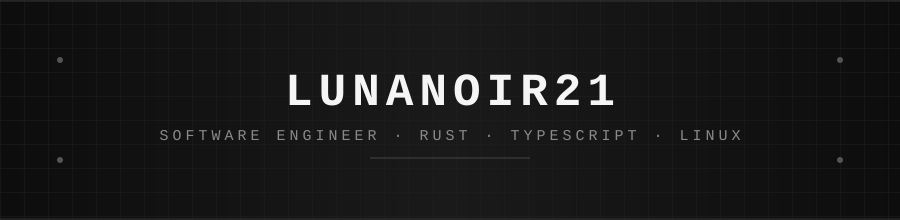

  

 

 

### Projects

| Project | Description |
|---|---|
| [**aurguard-project**](https://github.com/lunanoir21/aurguard-project) | Security guard for AUR packages — analyzes PKGBUILD and `.install` scripts before install. Rust, no telemetry. |
| [**dep-lens**](https://github.com/lunanoir21/dep-lens) | Scans dependencies across 9 ecosystems, classifies licenses, scores risk. Rust core + Node.js/Ink TUI. |
| [**quickshell-dynamic-island**](https://github.com/lunanoir21/quickshell-dynamic-island) | Monochrome Dynamic Island for Hyprland, built on Quickshell — MPRIS media, spectrum, pixel-art clock. |
| [**Life-os-project**](https://github.com/lunanoir21/Life-os-project) | Local-first personal life OS — habits, finance, notes, workouts. Next.js 14 + TypeScript. |

 

  
  

 

  <a href="https://github.com/lunanoir21">github.com/lunanoir21</a>

